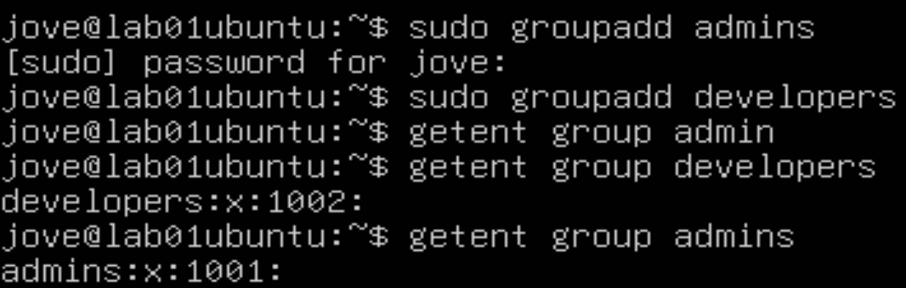
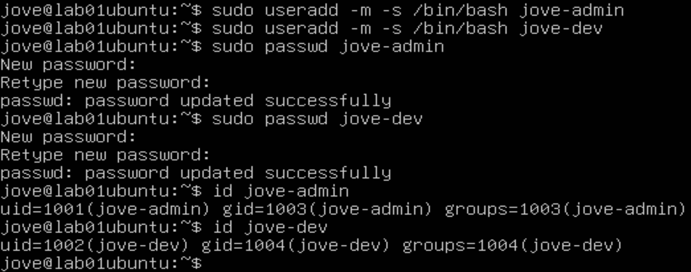
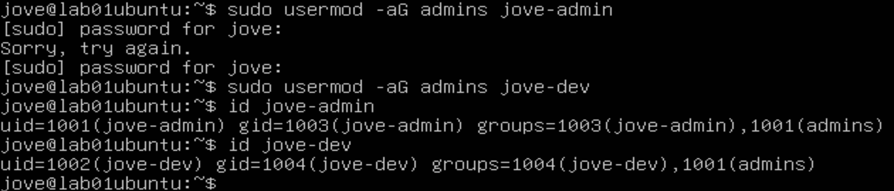
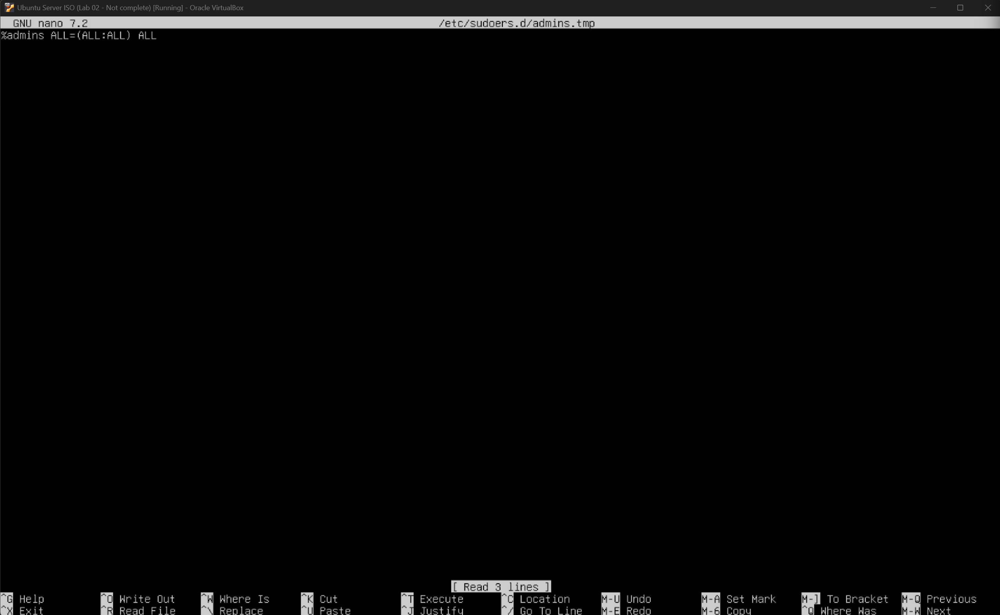
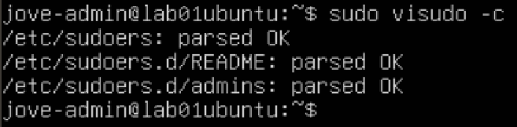
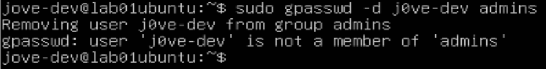

# Lab 2 — User and Group Management

## Lab Metadata
- **Category:** System Administration
- **Subdomain:** Linux Administration
- **Difficulty:** Beginner
- **Status:** Completed
- **Estimated Time:** 2–3 hours

---

## Objective
This lab focuses on managing Linux users and groups, implementing role-based access control, and enforcing least-privilege administration using `sudo`.

The goal is to demonstrate how administrative access is controlled through group membership and how misconfigurations can be identified and corrected.

---

## Environment
- **Host OS:** Windows 11
- **Hypervisor:** VirtualBox
- **Guest OS:** Ubuntu Server 22.04 LTS
- **Lab VM:** Same environment as Lab 01

---

## Tasks Performed

### Task 1 — Create Groups
Role-based groups were created to separate administrative and non-administrative users.

```bash
sudo groupadd admins
sudo groupadd developers
getent group admins
getent group developers
```
**Evidence:**
- [01-create-verify-groups](./screenshots/01-create-verify-groups.png)



### Task 2 — Create Users
Two users were created to represent different roles.
- jove-admin → administrative role
- jove-dev → standard (non-admin) role

```bash
sudo useradd -m -s /bin/bash jove-admin
sudo useradd -m -s /bin/bash jove-dev
sudo passwd jove-admin
sudo passwd jove-dev
```
**Evidence:**
- [02-create-users](./screenshots/02-create-users.png)



### Task 3 — Assign Users to Groups
Users were assigned to their respective groups.

```bash
sudo usermod -aG admins jove-admin
sudo usermod -aG developers jove-dev
id jove-admin
id jove-dev
```
**Evidence:**
- [03-assign-users-to-groups](./screenshots/03-assign-users-to-groups.png)



### Task 4 — Configure & Validate Sudo Access
Sudo access was granted only to the admins group using a dedicated sudoers file.

```bash
sudo visudo -f /etc/sudoers.d/admins
sudo chmod 440 /etc/sudoers.d/admins
sudo visudo -c
```
**Evidence:**
- [04-sudoers-admins-config](./screenshots/04-sudoers-admins-config.png)
- [05-sudoers-validate-visudo](./screenshots/05-sudoers-validate-visudo.png)
- [06-remove-admin-access](./screenshots/06-remove-admin-access.png)




During validation, a misconfiguration was identified where the jove-dev user had unintentionally inherited administrative privileges through group membership.

The issue was corrected by removing the user from the privileged group:

```bash
sudo gpasswd -d jove-dev admins
```

- jove-admin has full sudo access
- jove-dev has no sudo privileges


### Task 5 - Shared Directory with Group-Based Access (setgid)
A shared directory was created to allow collaborative access for the developers group while preventing access by non-members.

```bash
sudo mkdir -p /srv/devshare
sudo chown root:developers /srv/devshare
sudo chmod 2770 /srv/devshare
```
The setgid bit ensures all new files inherit the developers group.
Access was validated by testing write permissions as a group member and as a non-member.

**Evidence:**
- [07-sudo-access-jove-admin](./screenshots/07-sudo-access-jove-admin.png)
- [08-sudo-access-jove-dev-denied](./screenshots/08-sudo-access-jove-dev-denied.png)
- [09-devshare-permissions](./screenshots/09-devshare-permissions.png)
- [10-dev-write-success](./screenshots/10-dev-write-sucess.png)
- [11-non-member-denied](./screenshots/11-non-member-denied.png)


---

## Security Considerations
- Administrative privileges are granted strictly through group membership.
- Direct root login is avoided in favor of sudo.
- Sudoers configuration is isolated in /etc/sudoers.d/ and validated with visudo.
- Group-based permissions and setgid are used to control shared access without elevating privileges.

---

## Reflection
This lab helped me better understand how Linux access control works through groups and permissions rather than individual users. Working through permission issues showed me how easy it is to misconfigure access and how to verify and fix problems using commands like id, sudo -l, and ls -ld.

There are still plenty of Linux commands I’m getting familiar with, but running the lab locally in VirtualBox made it much easier to experiment and learn. I plan to redo this lab with minimal guidance to build more confidence.

---


## Next Steps
- Practice file ownership and permission management in more depth before proceeding to Lab 3
- Continue building Linux administration labs to strengthen troubleshooting skills

