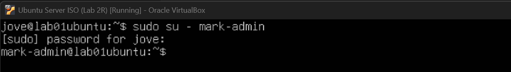
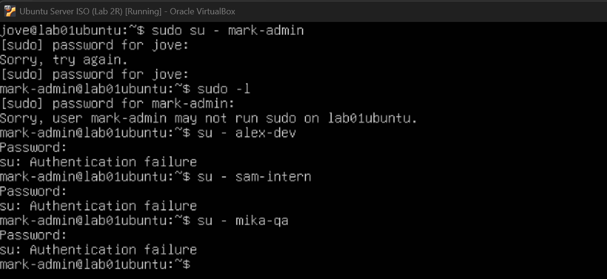

# Lab 2R — Linux User & Group Management (Independent Practice)

## Lab Metadata
- **Category:** System Administration
- **Subdomain:** Linux Administration
- **Difficulty:** Beginner
- **Mode:** Independent (no AI assistance), Scenario was AI generated
- **Status:** In Progress
- **Estimated Time:** (pending)

---

## Scenario Overview

You are acting as a **Junior Linux System Administrator** in a small organization.  
A new internal application project is starting, and you are responsible for:

- Onboarding users
- Managing group-based access
- Enforcing least privilege
- Troubleshooting permission issues
- Offboarding users cleanly

All access must be controlled through **groups and permissions**, not per-user exceptions.

---

## Environment
- **Host OS:** Windows 11
- **Hypervisor:** VirtualBox
- **Guest OS:** Ubuntu Server 22.04 LTS
- **Lab VM:** Keep Lab 2 users/groups and create new ones for this scenario

---

## Roles & Access Model

| Role | Purpose | Access Summary |
|-----|--------|----------------|
| sysadmin | Full system administration | Full sudo |
| devs | Application deployment | Write to app directory, limited sudo |
| qa | Testing and verification | Read-only access to logs |
| interns | Training only | Restricted training directory |

---

## Task 1 — Group / Role Management

### User Story
As an administrator, I want role-based groups so permissions can be managed consistently and securely.


### Acceptance Criteria
- [x] Groups exist and are visible in the system  
- [x] Group IDs and memberships can be verified  
- [x] No users have unnecessary privileges  


### Tasks Performed
Existing role-based groups (`admins` and `developers`) were already present from the initial Lab 2 setup, so these were reused and refined rather than recreated.

I used `getent group` to review all groups present on the system. This returned a large list, which initially caused some confusion. This behaviour is expected, as Linux includes many pre-existing system groups in addition to administrator-defined groups.

During this review, I observed that custom user and role-based groups typically start at GID 1000 and above, while system groups generally use lower GID values. While I have not yet explored the full reasoning behind this design choice, it has been noted for further research.

To align with clearer role naming and least-privilege principles, the following changes were made:
- Renamed `admins` to `sysadmins`
- Renamed `developers` to `devs`
- Created new role-based groups: `qas` and `interns`

New groups were created using the `groupadd` command, and existing groups were renamed using the `groupmod` command.


### Commands Used
```bash
getent group
groupadd <groupname>
groupmod -n <new-group-name> <old-group-name>
```

### Evidence
- [Check existing group](./screenshots/01-getent-group.png)
- [Add a group](./screenshots/02-group-add.png)
- [Modify Group](./screenshots/03-group-mod.png)
- [Verify updates](./screenshots/05-verify-group-update.png)


### Reflection
In this task I learned how effective group naming and structure support role-based access control (RBAC). Renaming and reusing groups mirrored real-world administration, where changes are often made on existing systems rather than starting from scratch. Task 1 was straightforward and commands were easy to follow.

---


## Task 2 — User Management


### User Story
As an administrator, I want new staff accounts created with correct group membership and secure defaults.


### Acceptance Criteria
- [x] Users exist and can log in
- [x] Correct primary and secondary groups assigned
- [x] Home directories exist with correct ownership
- [x] No administrative access granted unintentionally


### Tasks Performed
To reduce naming confusion and better reflect role intent, I first renamed the existing administrative user `jove-admin` to `mark-admin`. During this process, I learned that Linux does **not** automatically update a user’s primary group name or home directory when a username is modified. These components must be handled separately to maintain consistency. In the screenshot I did 3-steps to complete the setup. 


After confirming the administrative account was correctly updated, I created additional role-based users for the environment. Each user was created with a home directory and default shell, then verified to ensure correct UID, GID, group membership, and home directory ownership.

- **Developers** alex-dev
- **QA** mika-qa
- **Interns** sam-intern

  
  
 


Note: Attempts to elevate privileges using `sudo` and switch users using `su` were intentionally denied. This confirms that only explicitly authorised accounts can perform administrative actions, enforcing least-privilege access.




### Commands Used
```bash
usermod -l <new-username> <old-username>
groupmod -n <new-groupname> <old-groupname>
ls -ld /home/<username>
useradd -m -s /bin/bash <username>
getent passwd <username>
id <username>
sudo -l -U <username>
```

### Reflection
This task showed that updating user accounts in Linux often involves multiple steps to keep usernames, groups, and home directories consistent. Creating and validating role-based users reinforced the importance of checking permissions instead of relying on defaults. I’ll need more practice with Task 2 to fully lock in the workflow.

---


## Task 3 — Configure Shared Directories & Permissions (pending)


### User Story
As a team, we need shared directories where access is granted only to the appropriate roles.


### Acceptance Criteria
- [ ] Dev users can write to the application directory
- [ ] QA users can read logs but cannot modify them
- [ ] Interns can only access the training directory
- [ ] Unauthorized access attempts fail


### Directories
- **Application directory:**  
- **Log directory:**  
- **Training directory:** 


### Tasks Performed
Three directories were created using a single `mkdir` command (`mkdir dir1 dir2 dir3`). This approach is more efficient than creating each directory individually and helps reduce repetitive steps. For demonstration purposes, additional directories were also created manually via bash.


Users had previously been created with their own home directories. In this task, users were added to their respective shared groups to enable group-based access. For example, `alex-dev` was added to the `devs` group, and group membership was verified to confirm the update.


Directory ownership and permissions were then updated to allow the appropriate group write access. The application directory was assigned to the `devs` group, with permissions configured to allow group collaboration while restricting access for non-members.


The same process was repeated for the remaining directories to ensure all acceptance criteria were met.


### Commands Used
```bash
mkdir <directoryname>
mkdir <dir1> <dir2> <dir3>
usermod -aG <groupname> <username>
id <username>
ls -l
chown :<groupname> <directoryname>
chmod 2775 <directoryname>
ls -l <directoryname>
``` 


### Reflection
This task reinforced how group-based permissions simplify access management across shared directories. Using group ownership and setgid reduced the need for individual user permissions and made the setup easier to maintain. I’m getting more comfortable with the workflow, but I still get mixed up with the numeric values for setgid and permissions, so I’ll need more hands-on practice.


---


## Task 4 — Implement Least-Privilege Sudo Access (pending)

### User Story
As an administrator, I want developers to run limited administrative commands without granting full sudo access.

### Scope of Elevated Access
- **Allowed:**  
- **Not allowed:**  

### Tasks Performed
- 
- 
- 

### Acceptance Criteria
- [ ] `sudo -l` shows only approved commands
- [ ] Privilege escalation beyond scope is denied
- [ ] System integrity remains intact

### Evidence
- Screenshot(s):
- Command output(s):

---

## Task 5 — Incident Response: Permission Denied (pending)

### Incident Description
A developer reports receiving **“Permission denied”** while working in the application directory.

### Investigation
- **Observations:**  
- **Root cause identified:**  

### Resolution
- 
- 
- 

### Acceptance Criteria
- [ ] Root cause clearly identified
- [ ] Issue resolved without weakening security
- [ ] Least privilege preserved
- [ ] Access restored only where appropriate

### Evidence
- **Before:**  
- **After:**  

---

## Task 6 — User Offboarding & Audit (pending)

### User Story
As an administrator, I want to remove access cleanly when a staff member leaves.

### Offboarded User
- **Username:**  
- **Role:**  

### Tasks Performed
- 
- 
- 

### Acceptance Criteria
- [ ] User can no longer log in
- [ ] Group memberships updated
- [ ] No orphaned permissions remain
- [ ] Audit snapshot captured

### Evidence
- Screenshot(s):
- Command output(s):

---


## Next Steps

- 
- 
- 

---

### Notes
This lab was completed **without AI assistance**, using:
- Personal notes
- System documentation (`man`)
- Trial-and-error testing
- Research and Video tutorials
