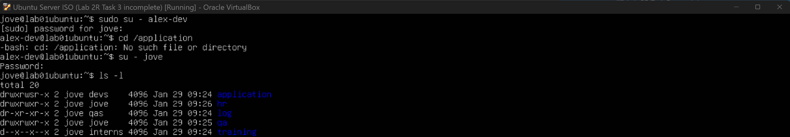
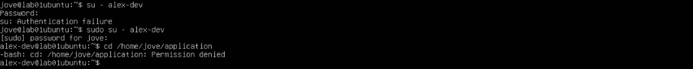
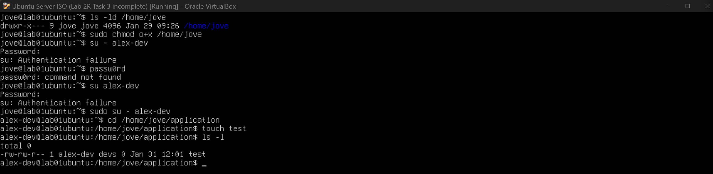
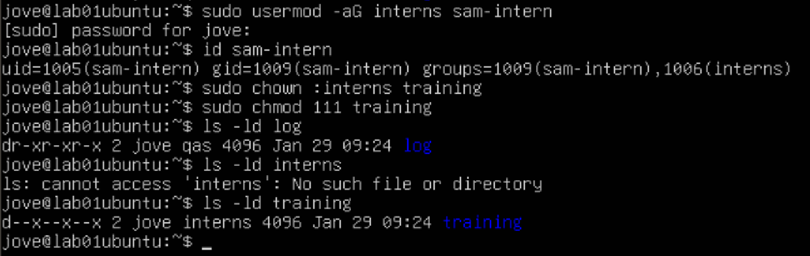

## Task 3 — Configure Shared Directories & Permissions (pending)


### User Story
As a team, we need shared directories where access is granted only to the appropriate roles.


### Acceptance Criteria
- [x] Dev users can write to the application directory
- [ ] QA users can read logs but cannot modify them
- [ ] Interns can only access the training directory
- [x] Unauthorized access attempts fail


### Directories
- **Application directory:**  
- **Log directory:**  
- **Training directory:** 


### Tasks Performed
Three directories were created using a single `mkdir` command (`mkdir dir1 dir2 dir3`). This approach is more efficient than creating each directory individually and helps reduce repetitive steps. For demonstration purposes, additional directories were also created manually via bash.


Users had previously been created with their own home directories. In this task, users were added to their respective shared groups to enable group-based access. For example, `alex-dev` was added to the `devs` group, and group membership was verified to confirm the update.


Directory ownership and permissions were then updated to allow the appropriate group write access. The application directory was assigned to the `devs` group, with permissions configured to allow group collaboration while restricting access for non-members.


When I tested whether `alex-dev` (in the `devs` group) could access the `application` folder, I initially got **“No such file or directory”**. This turned out to be a **path issue** — I was trying to access `/application`, but the folder I created was actually inside my home directory (e.g. `/home/jove/application`).



I tried again using the correct location but I got **“Permission denied”**. I was sure that the application folder was for the devs group in which alex-dev is a member of. 



To address the permission issue, I reviewed the permissions on both the application directory and its parent directory. It took some time to fully understand the permission string format, but this exercise helped clarify how Linux evaluates access step by step.


I learned that Linux checks permissions on **every directory in the path**, starting from the root and moving down to the target directory. If access is denied at any level, the check stops immediately.

---

### Breakdown: `drwxr-x---` Parent Directory (`/home/jove`)

- **d** → directory

**Owner permissions**
- `r` → can list contents  
- `w` → can create, delete, or rename files  
- `x` → can enter the directory  

**Group permissions**
- `r` → group can list contents  
- `x` → group can enter the directory  
- `-` → no write access  

**Other permissions**
- `-` → no read  
- `-` → no write  
- `-` → no execute (cannot enter directory) !!!

Because `alex-dev` is neither the owner (`jove`) nor a member of the `jove` group, Linux evaluated the **others** permissions and denied access at this level.


### Breakdown: `drwxrwsr-x` Application Directory

- **d** → directory

**Owner permissions**
- `r` → can list contents  
- `w` → can create, delete, or rename files  
- `x` → can enter the directory  

**Group permissions**
- `r` → group can list contents  
- `w` → group can create and delete files  
- `s` → setgid (new files inherit the directory’s group)

**Other permissions**
- `r` → can list contents  
- `x` → can enter the directory  
- `-` → no write access  

Even though the application directory was correctly configured for the `devs` group, access was blocked earlier due to the restrictive permissions on the parent directory. This issue proves that Linux enforces permissions on every directory in the path, not just the target directory. 

To fix this issue, I needed to “open the gate” on the `/home/jove` folder so Linux could reach the `application` directory inside it. The problem wasn’t the application folder itself, but the parent directory blocking access.  

I updated the **other** permissions from `-` to `x`, which allows users to pass through the directory without being able to see or modify its contents.

This was done using:
```bash
sudo chmod o+x /home/jove
```

### Breakdown:
- sudo – run the command with admin privileges
- chmod – change permissions
- o – refers to others (not the owner or group)
- +x – add execute (traverse) permission
- /home/jove – target directory

This resolved the access issue without moving the directory. Authorized users can now traverse the path to the shared application folder, while the contents of the home directory remain protected.




### Commands Used
```bash
mkdir <directoryname>
mkdir <dir1> <dir2> <dir3>
usermod -aG <groupname> <username>
id <username>
ls -l
chown :<groupname> <directoryname>
chmod 2775 <directoryname>
sudo chmod o+x <path or folder>
``` 

### Reflection
This task reinforced how group-based permissions simplify access management across shared directories. Using group ownership and setgid reduced the need for individual user permissions and made the setup easier to maintain. I’m getting more comfortable with the workflow, but I still get mixed up with the numeric values for setgid and permissions, so I’ll need more hands-on practice.



